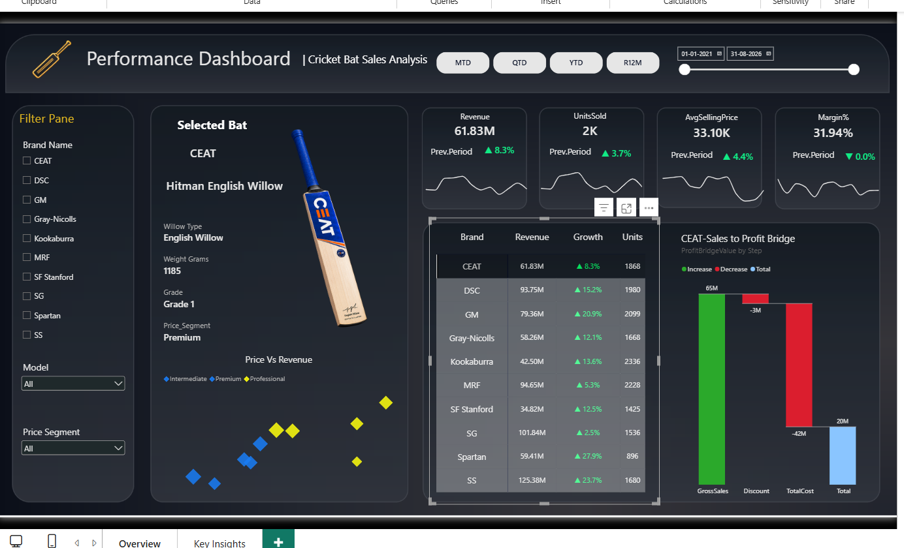
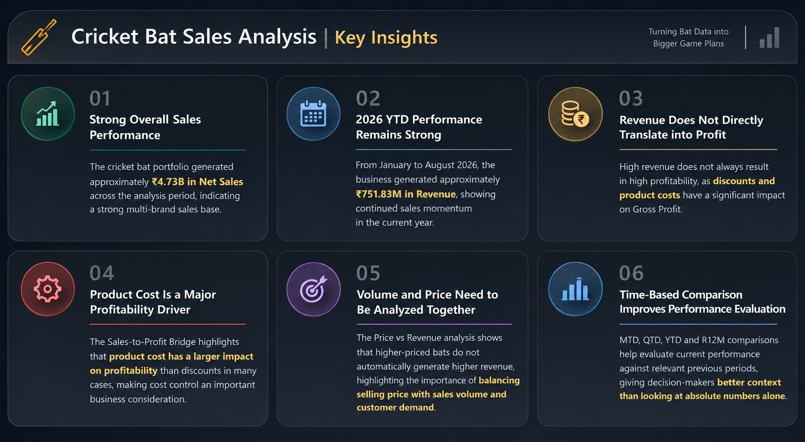

# 🏏 Cricket Bat Sales Analysis | SQL Server + Power BI

An end-to-end data analytics project exploring cricket bat sales performance, pricing, and profitability using **Microsoft SQL Server** and **Power BI**.

## 📌 Project Overview

This project starts with three CSV files—`bat_file`, `brand_file`, and `sales_file`. The data is imported into SQL Server, checked for data-quality issues, and prepared through SQL views before being connected to Power BI for analysis.

The Power BI report contains two pages:
1. **Dashboard Overview** — interactive KPIs and visual analysis.
2. **Key Insights** — business findings and observations from the analysis.

## 🎯 Objectives

- Prepare imported sales data for analysis using SQL Server.
- Check for NULL values and duplicate records.
- Create reusable SQL views with only the required columns.
- Analyze brand performance, revenue, units sold, pricing, and profitability.
- Use Power BI and DAX to build an interactive report and communicate business insights.

## 🧰 Tools & Technologies

- **Microsoft SQL Server** — CSV imports, data-quality checks, joins, and views
- **SQL** — `INNER JOIN`, column selection, NULL checks, and duplicate checks
- **Power BI Desktop** — data connection, report pages, visuals, and interactions
- **DAX** — KPI measures and time-intelligence calculations

## 🔄 Project Workflow

1. **Import data:** Loaded `bat_file`, `brand_file`, and `sales_file` CSV files into SQL Server.
2. **Validate data:** Checked for NULL values and duplicate records.
3. **Prepare data:** Created two SQL views using `INNER JOIN` and retained only the columns needed for analysis:
   - `dim_bat`
   - `fact_sales`
4. **Connect Power BI:** Imported the prepared views from SQL Server into Power BI.
5. **Build the report:** Developed an interactive, two-page sales analysis dashboard.
6. **Derive insights:** Reviewed performance, pricing, sales-to-profit movement, and time-based trends.

## 📊 Dashboard Pages

### 1. Dashboard Overview

The overview page includes:
- KPI cards: **Revenue, Units Sold, Average Selling Price, and Margin %**
- Time-period selection: **MTD, QTD, YTD, and Rolling 12 Months (R12M)**
- A brand performance matrix showing **Revenue, Growth %, and Units Sold**
- A **Price vs. Revenue scatter plot**, with average list price on the X-axis, selected-period revenue on the Y-axis, price segment as the legend, and units sold represented by bubble size
- A **dynamic Waterfall Chart** showing the sales-to-profit bridge
- Interactive filters for exploring bat and brand performance

The time-period buttons control the selected reporting period. The report defaults to **YTD** and uses DAX, including `SELECTEDVALUE()`, to drive dynamic KPI calculations.

### 2. Key Insights

The second page summarizes findings from the analysis, including:
- Overall sales performance
- YTD revenue performance
- The effect of discounts and product costs on profitability
- The relationship between price, sales volume, and revenue
- The value of comparing performance across different time periods

## 📊 Power BI Dashboard

### Dashboard Overview



### Key Insights



## 🎥 Project Walkthrough

A complete project walkthrough is available on my LinkedIn profile.

[View Project Walkthrough on LinkedIn](https://lnkd.in/p/dRAbp5KG)


## 🗂️ Repository Structure

```text
Cricket-Bat-Sales-Analysis/
├── README.md
├── SQL/
│   ├── README.md
│   ├── 01_data_quality_checks.sql
│   └── 02_create_views.sql
├── PowerBI/
│   └── README.md
├── Screenshots/
│   └── README.md
└── Video/
    └── README.md

```

## 🚀 How to Explore This Project

1. Review the SQL scripts in the `SQL/` folder.
2. Open the `.pbix` file in Power BI Desktop (add it to `PowerBI/` when ready).
3. View the dashboard screenshots in `Screenshots/`.


## 💡 Key Skills Demonstrated

- SQL data-quality validation
- Joining and preparing relational data
- Creating reusable SQL views
- Connecting Power BI to SQL Server
- DAX measures and time intelligence
- Interactive dashboard design
- KPI analysis and business storytelling

## 👩‍💻 Author

**Asha Korada**  
Aspiring Data Analyst | SQL | Power BI | DAX | Data Analytics

- GitHub: [ASHA-KORADA](https://github.com/ASHA-KORADA)
- LinkedIn: www.linkedin.com/in/asha-korada


## 💬 Feedback

Suggestions and feedback are welcome. Feel free to share ideas for improving the analysis, SQL workflow, or dashboard design.
